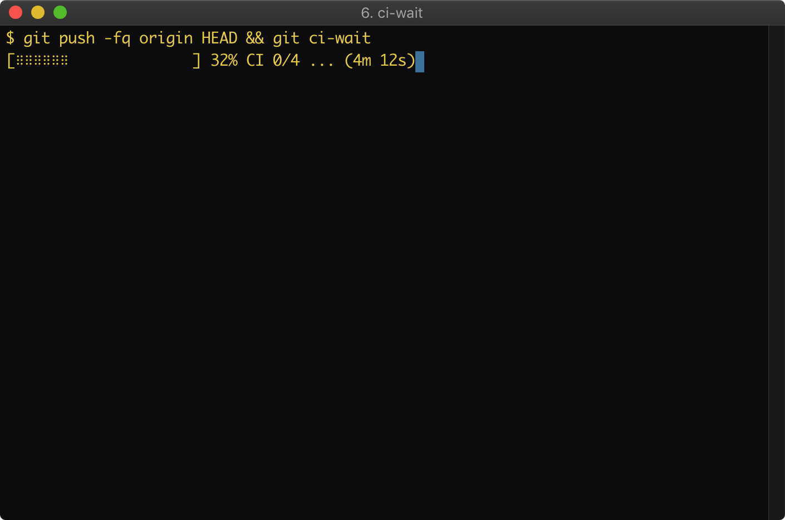

<a href="doc/images/git-ci-wait-example.png">
    
</a>

# Overview

Poll GitHub CI status at the CLI, showing progress, and alerting when tests are finished.

 * [Quickstart](#quickstart)
 * [Explanation](#explanation)
 * [Notes](#notes)
 * [Compatibility and Requirements](#compatibility-and-requirements)

# Quickstart

 * Place `bin/git-ci-wait` on your `$PATH`
 * Remember to `chmod u+x git-ci-wait`, too
 * Install [gh](https://github.com/cli/cli)
 * Run `gh auth login`
 * Open a Pull Request with CI
 * Run `git ci-wait`
 * `git push -f && git ci-wait` is another good usage

# Explanation

[gh](https://github.com/cli/cli) is wonderful, but it doesn't poll.

`git-ci-wait` also has a small value-add in the form of an estimated time-to-completion
and progress bar.

The progress bar is based on historical statistics, so it won't appear until the
*second invocation* in a given repository.

# Notes

## Stickiness

`git-ci-wait` remembers which branch it is monitoring, even when the branch
name is implicit.  It is safe to check out a different branch while it is
running.

## Settings

Several settings can be changed via `git config`.  For example, this setting
would cause `git-ci-wait` to attempt a desktop notification when CI completes:

```bash
git config --global ci-wait.try-desktop-notify 1
```

See the detailed helpdoc at `git ci-wait -h`.

## Polling

This script tries not to abuse GitHub's API.

After the first execution in a given repository, `git-ci-wait` will have access
to past CI runtimes, which will be leveraged to increase polling granularity,
but only near the expected completion time.  See `git ci-wait -h` for
relevant settings.

## Testing

`git ci-wait -test_ui` will test configured notifications and events without
consulting CI status.

# Compatibility and Requirements

Requires

 * bash 3.1+
 * awk

which you should already have.

Requires [gh](https://github.com/cli/cli) which does the actual work.
